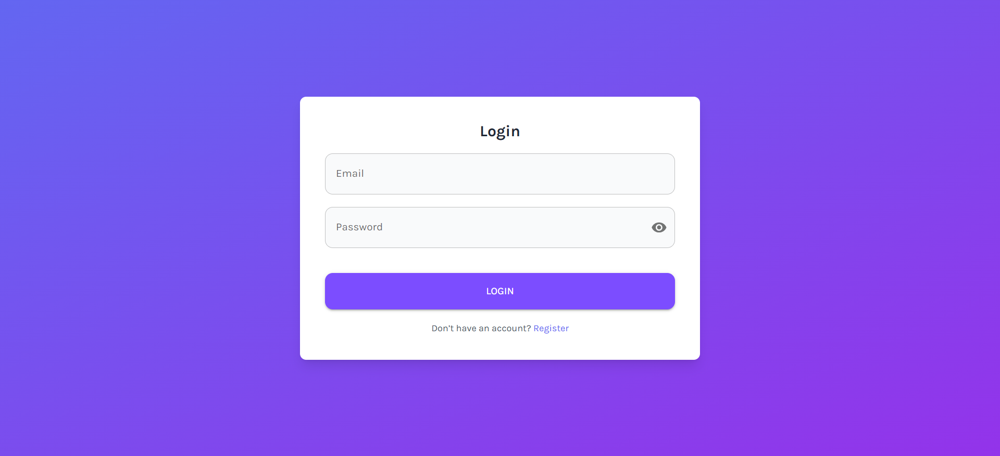
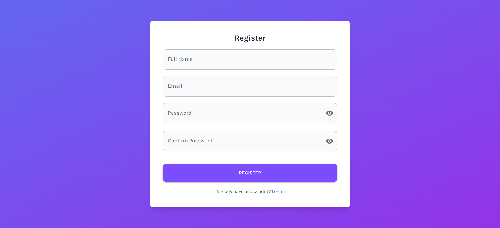
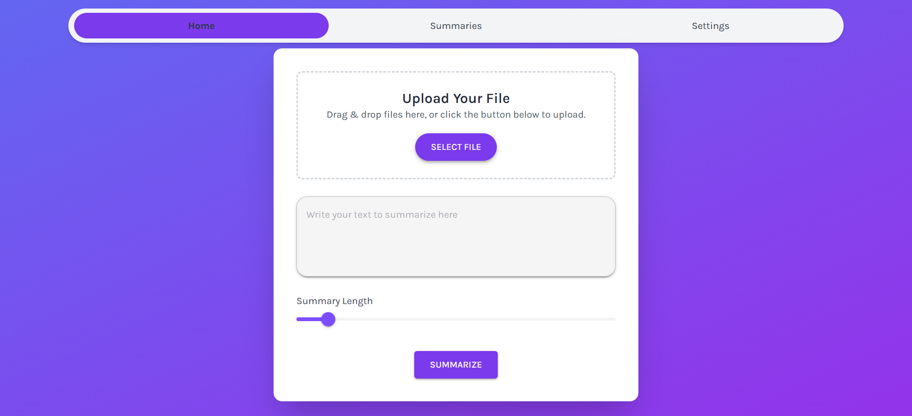
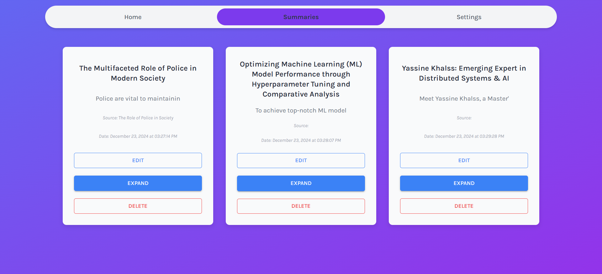
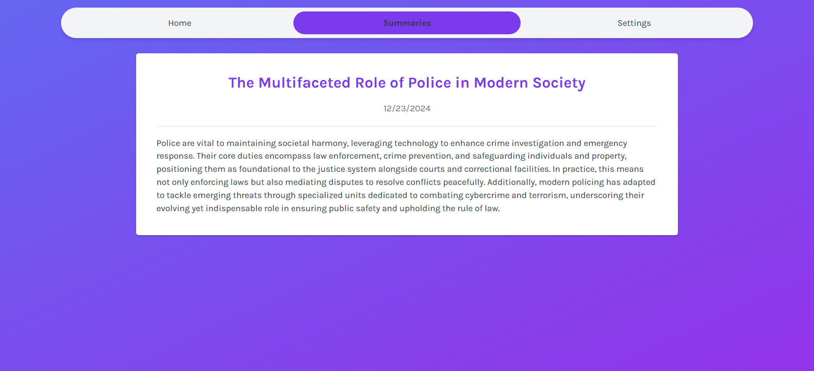
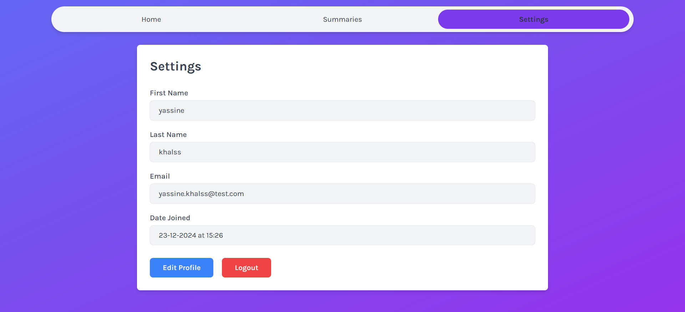

# Advanced Text Summarization Web Platform

## Overview
This project is a fully secured web platform designed for advanced text summarization. It combines cutting-edge AI models with a robust web architecture built using **Django** for the backend, **React.js** for the frontend, and **PostgreSQL** for data storage. The platform employs **JWT-based authentication** to ensure security and integrates AI-powered text summarization that combines extractive and generative methods for high-quality results.

## Features
- **AI-Driven Summarization**: Combines enhanced TextRank with sentence clustering and LLM refinement for fluent, coherent summaries.
- **Secure Authentication**: Implements JSON Web Tokens (JWT) for secure user authentication and session management.
- **Modern Web Stack**: Built using Django (backend), React.js (frontend), and PostgreSQL (database).
- **User-Friendly Interface**: Intuitive UI for users to input text, manage summaries, and view results.
- **Scalable Architecture**: Designed to handle large-scale text data efficiently.

---

## Technology Stack
- **Frontend**: React.js
- **Backend**: Django
- **Database**: PostgreSQL
- **Authentication**: JSON Web Tokens (JWT)
- **AI Models**: Leveraging state-of-the-art LLMs and NLP libraries for summarization.

---

## Methodology

This platform employs an innovative, hybrid approach to text summarization that integrates **extractive techniques** with **generative refinement** for producing fluent, coherent summaries. The process is divided into several stages:

---

### 1. Sentence Clustering
To improve the coverage of key ideas in the text, we introduce **sentence clustering** as a preprocessing step:
- **Semantic Representation**:
  - Each sentence in the input text is converted into a numerical vector representation using **word embeddings** (Sentence-BERT).
- **Clustering**:
  - Sentences are grouped into clusters based on their semantic similarity using clustering algorithms such as **K-means**.
  - This ensures that diverse and important ideas are represented in the summary, avoiding redundancy.
- **Representative Sentence Selection**:
  - From each cluster, the most representative sentence is chosen based on its centrality.

---

### 2. Enhanced TextRank
The platform uses an enhanced version of the **TextRank algorithm**:
- **Graph Construction**:
  - Sentences are treated as nodes in a graph.
  - Edges between sentences are weighted based on semantic similarity, calculated using cosine similarity of their vector representations.
- **Ranking**:
  - TextRank iteratively scores sentences using a graph-based ranking model, similar to Google's PageRank algorithm.
- **Cluster-Aware Selection**:
  - By applying TextRank within each cluster, the algorithm ensures better coverage of key ideas and prioritizes high-ranking sentences.

---

### 3. LLM Refinement
After extracting top-ranked sentences, they are passed to a **Large Language Model (LLM)** for further refinement:
- **Coherence Improvement**:
  - The LLM ("nvidia/llama-3.1-nemotron-70b-instruct") rephrases and organizes the extracted sentences to enhance readability and logical flow.
- **Fluency Enhancement**:
  - By leveraging the LLM’s generative capabilities, the summary becomes more human-like, avoiding the choppy style often produced by extractive methods.
- **Context Preservation**:
  - The LLM integrates contextual cues from the text to ensure the summary remains accurate and concise.

---

### 4. Evaluation
Traditional metrics like ROUGE and BLEU focus on surface-level comparisons, which may not always align with human perceptions of summary quality. Instead, the platform incorporates **LLM-based evaluation**:
- **Fluency and Coherence Scoring**:
  - The LLM is used to assess the overall quality of generated summaries, providing scores for fluency, coherence, and contextual relevance.
- **Comparative Metrics**:
  - While LLM-based evaluation is the primary method, ROUGE scores are also calculated to compare performance with conventional approaches.

---

### 5. Integration into the Platform
- **Web Interface**:
  - Users interact with the summarization system through an intuitive web UI where they can upload text, manage summaries, and view results.
- **Customizable Preferences**:
  - Users can choose settings such as summary length or level of abstraction.
- **Real-Time Processing**:
  - The summarization process, powered by a combination of Django and AI models, ensures near real-time results.

By combining the precision of extractive methods, the fluency of generative techniques, and advanced evaluation metrics, this platform delivers high-quality summaries tailored to diverse user needs.


---

## Getting Started

### Prerequisites

- **Node.js** (version 20) and **npm** for frontend development
- **Python** (version 3.12) for backend development
- **PostgreSQL** (version 16.3) for database management

### Setup

#### Frontend

1. Clone the repository:

   ```bash
   git clone https://github.com/YASSINEKS007/NLP-Text-Summarization-Django-React.git
   ```

2. Navigate to the frontend directory:

   ```bash
   cd frontend
   ```

3. Install dependencies:

   ```bash
   npm install
   ```

4. Start the development server:

   ```bash
   npm run dev
   ```

   The frontend will be available at [http://localhost:3000](http://localhost:3000).

#### Backend

1. Navigate to the backend directory:

   ```bash
   cd backend
   ```

2. Create and activate a virtual environment:

   ```bash
   virtualenv venv
   ```

   - Activation on Windows:
   
     ```bash
     venv\Scripts\activate
     ```
   - Activation on macOS or Linux:
   
     ```bash
     source venv/bin/activate
     ```

3. Install dependencies:

   ```bash
   pip install -r requirements.txt
   ```

#### Database Setup

1. **Configure Database Connection:**

   - Edit the `.env` file to configure your PostgreSQL database connection settings.

2. **Run Database Migrations:**
   - Apply the migrations to set up the database schema:
     ```bash
     python manage.py makemigrations
     ```
     ```bash
     python manage.py migrate
     ```

### Configuration

#### Frontend

- **File:** `.env`
- **Variable:**
  - `VITE_BACKEND_HOST=`: Set this to the backend host URL.

#### Backend

- **File:** `.env`
- **Variables:**

  - `DJANGO_SECRET_KEY=`: Your Django secret key.
  - `DJANGO_ALLOWED_ORIGINS=`: Comma-separated list of allowed origins for CORS.
  - `DJANGO_ALLOWED_METHODS=`: Comma-separated list of allowed HTTP methods (e.g., GET, POST).
  - `DJANGO_ALLOWED_HEADERS=`: Comma-separated list of allowed headers.

  - **Database Configuration:**
    - `DB_NAME=`: Name of the PostgreSQL database.
    - `DB_USER=`: Username for the PostgreSQL database.
    - `DB_PASSWORD=`: Password for the PostgreSQL database.
    - `DB_HOST=`: Host of the PostgreSQL database server.
    - `DB_PORT=`: Port number for the PostgreSQL database server.
    
  - **LLM API key Configuration:**
    - `NVIDIA_API_KEY` : The nvidia/llama-3.1-nemotron-70b-instruct api key.

## Usage

### Login/Sign-Up
- Access the platform using secure JWT-based authentication.

### Input Text
- Upload or paste text to be summarized.

### Generate Summary
- Choose summarization preferences and generate summaries powered by AI.

### Manage Results
- Save and view previously generated summaries.

---

## Security

### JWT Authentication
- Ensures secure login and API access.

### Data Protection
- All sensitive data is encrypted and securely stored in PostgreSQL.

### CSRF and XSS Protection
- The platform adheres to best practices to mitigate security risks.

## Screenshots

- **Login Page**
  

  - The Login page where users can sign in to our platform.

- **Register Page**
  

  - The Register page where users can sign up to our platform.

- **Main Page**
  

  - An overview of the primary application interface, where users can interact with the system to upload PDFs or Word documents, or directly input text for summarization.

- **Summaries Page**
  

  - The pages where summaries are stored, allowing users to access and review them at any time.

- **Summary Page**
  

  - Example of a generated Summary.

- **Settings Page**
  

  - The settings page where users can view and update their information.


## Contributing

Contributions are welcome! Please fork the repository and submit a pull request with your changes.

## License

This project is licensed under the MIT License - see the [LICENSE](LICENSE) file for details.

## Contact

For any questions or issues, please contact [yassinekh007007@gmail.com].
